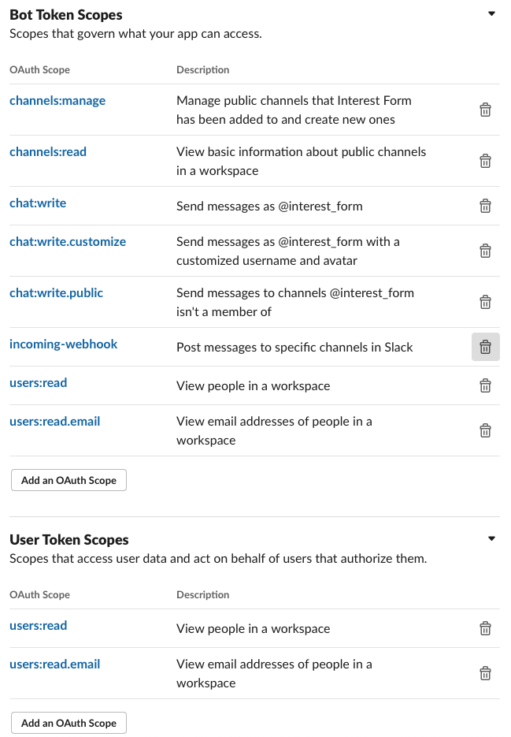

# EveryAction Interest Form --> Slack
Sends contacts from an EveryAction report to a Slack channel to invite them to the Slack workspace

## How to Use
1. Create a scheduled report in EveryAction and send it to an email you can pipe to a PHP script. Ensure that the report contains the following fields:
  - DOB
  - Personal Email (if you want to use a different email from their contact record, you'll have to edit [parse-email.php](parse-email.php))
  - Contact Name
2. Pipe emails to the email specified in EveryAction to [report-pipe.php](report-pipe.php)
3. Set your Slack API token (the bot OAuth access token) and channel ID (starts with C) in [lines 10 and 11 of parse-email.php](parse-email.php#L10) and [line 4 of interactive-hook.php](interactive-hook.php#L4)
3. If you have a maximum age for hub members, edit `+20 years` on [line 42 of parse-email.php](parse-email.php#L42). If you do not have a maximum age, remove lines 41-44.
4. Edit the `$payload = ` JSONs to customize the message sent in the specified Slack channel
5. In [interactive-hook.php](interactive-hook.php), edit the message, icons, and names in the messages returned to users who interact with the buttons sent with the payloads you customized above

## Slack set up
1. In the Interactivity & Shortcuts section of your app's API settings, enter the public link to your `interactive-hook.php` file
2. Set the OAuth scopes of the app to include at least the following scopes: 
